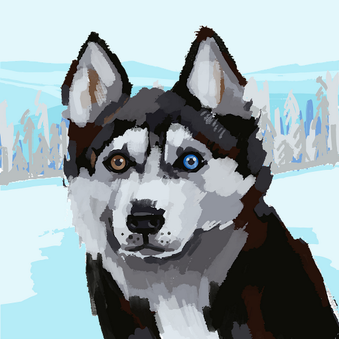

# Godi Media Unmasked

  
*Where Lapdogs Bark Louder Than Watchdogs*

Welcome to **Godi Media Unmasked**, an open-source project dedicated to exposing the circus of biased media with satire, facts, and a healthy dose of humor. Hosted at [https://godi-modi.github.io/](https://godi-modi.github.io/), this is a battle for awareness—a space for patriots to call out the boot-polishing, decibel-driven nonsense masquerading as journalism. Join the fight, contribute, and let’s unmask the circus together!

## Features
- **Multilingual Support**: Available in English, Hindi, Tamil, Telugu, and Marathi (add more languages by contributing!).
- **Hall of Shame**: A satirical showcase of media absurdities (no real names, just witty placeholders).
- **Fact vs. Fiction**: Separating WhatsApp University myths from reality.
- **Meme Zone**: Coming soon—add your own memes to roast the circus!
- **Responsive Design**: Works on desktops, tablets, and mobiles.

## Live Demo
Check out the live site here: [https://godi-modi.github.io/](https://godi-modi.github.io/)

## Getting Started
Want to run this locally or contribute? Follow these steps:

### Prerequisites
- A GitHub account.
- Basic knowledge of HTML, CSS, and JavaScript.
- Git installed on your machine.

### Installation
1. **Fork the Repository**  
   Click the "Fork" button at the top-right of this page to create your own copy.

2. **Clone the Repo**  
   ```bash
   git clone https://github.com/godi-modi/godi-media-unmasked.git
   cd godi-media-unmasked
   ```

3. **Open Locally**  
   Open `index.html` in your browser to view the site locally. No server setup needed!

4. **Make Changes**  
   Edit the code, add content, or tweak the design—go wild!

5. **Deploy to GitHub Pages**  
   - Push your changes to your forked repo:
     ```bash
     git add .
     git commit -m "Added my patriotic contribution"
     git push origin main
     ```
   - Enable GitHub Pages in your repo settings under "Pages" > Set source to `main` > Root directory.

## Contributing
This is a fight for awareness, and every patriot’s voice counts! Here’s how you can contribute:

1. **Add Content**  
   - New "Hall of Shame" entries (keep it satirical, no real names).
   - Fact vs. Fiction comparisons.
   - Memes (upload images and link them in the Meme Zone).

2. **Improve Design**  
   - Enhance CSS for better visuals.
   - Add animations or interactive elements.

3. **Expand Languages**  
   - Add translations to the `translations` object in `index.html` for new languages.

4. **Submit a Pull Request**  
   - Fork the repo, make changes, and submit a PR with a clear description of your contribution.
   - Example PR title: "Added Telugu Meme Zone Entry."

5. **Ideas Welcome**  
   - Open an issue to suggest features, report bugs, or brainstorm new sections.

### Guidelines
- Keep it satirical and fun—shade, not slander.
- Avoid real personal names; use creative placeholders (e.g., "Screamer McLoud").
- Respect the open-source spirit—credit contributors where due.

## Project Structure
```
godi-media-unmasked/
├── index.html       # Main HTML file with all content and logic
├── README.md        # This file
└── (future assets)  # Add images, CSS files, or JS files as needed
```

## License
This project is licensed under the [MIT License](LICENSE). Feel free to use, modify, and distribute it—just keep the spirit of awareness alive!

## Acknowledgments
- Built with love, caffeine, and a disdain for 9 PM shouting matches.
- Thanks to all patriots who join this battle for truth and laughter.

## Contact
Got questions or want to collaborate? Open an issue on this repo.

Let’s unmask the circus together! 🇮🇳✊
